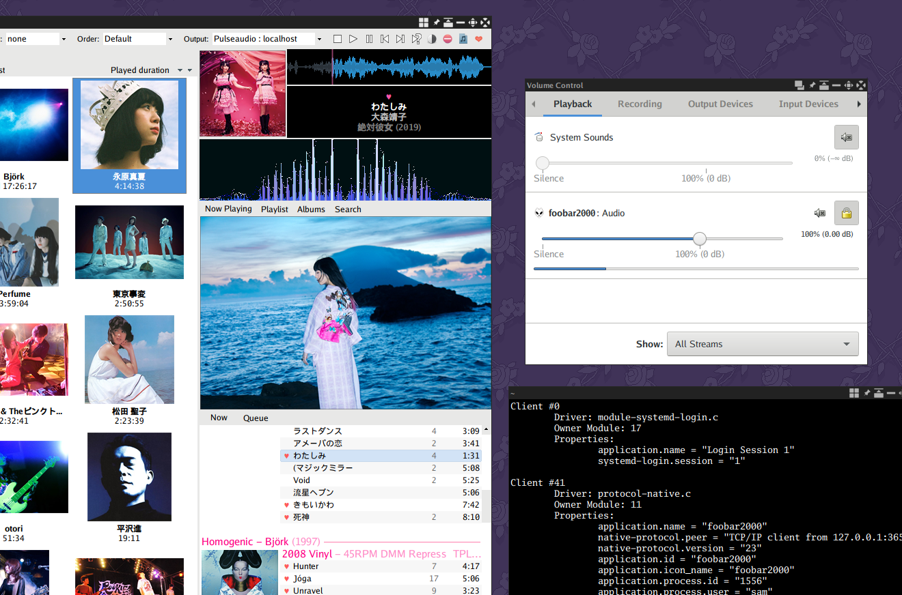

# foo_out_pulse
Native event-based PulseAudio output for foobar2000, for use in Wine.

## Setup
This component connects to 127.0.0.1 using Pulse's native TCP protocol.
First you have to enable the module for this protocol for the Pulse daemon by editing either
`/etc/pulse/default.pa` or `~/.config/pulse/default.pa` and adding or editing the following line:

`load-module module-native-protocol-tcp auth-ip-acl=127.0.0.1`

NB: Do understand the security implications of this before making this change.

For the icon to appear in the mixer, you will need to place a png of foobar's icon in, for example, `~/.icons/hicolor/256x256/apps/`

## Advantages
Foobar works very well in Wine, but Wine's default Pulseaudio output has some disadvantages. Compared to using the standard output, this component
- May be less liable to cause audio dropouts when performing IO-intensive tasks such as tag writing,
- Has a custom fading implementation for seek/track change that doesn't require reducing Pulseaudio's buffer length to work (configure in Advanced Preferences -> Playback -> Pulseaudio output),
- Doesn't resample unnecessarily, making the most of Pulseaudio's `avoid-resampling` option,
- Can show foobar's icon in the system mixer,
- Integrates with Pulseaudio's volume control so there is no delay in volume adjustment.

## Todo
Currently it
- Doesn't support authentication via cookies,
- Only connects to localhost,
- Probably doesn't properly pass through channel mappings from source files correctly,
- Doesn't support connecting via Unix socket like normal programs (unless you build libpulse-0.dll using the libpulse-wine repo - currently not recommended as in my testing it was unstable and it's not clear that there is any real benefit to using it).
